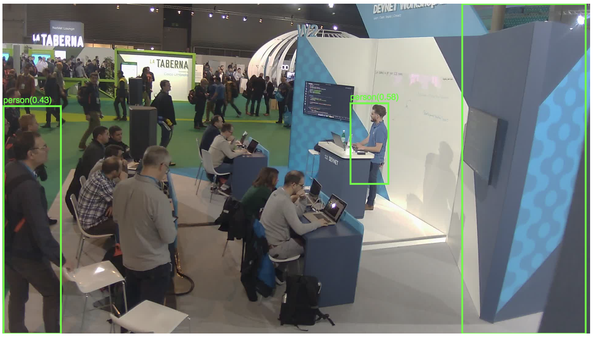

## Meraki Real-Time Object Detection
 
This app can image object detection via Meraki Camera snapshot API in browser. Using YOLO(You only look once) real-time object detection built-in [ML5.js](https://ml5js.org/) (based on [Tensorflow.js](https://js.tensorflow.org/)) to detect images returned from Meraki Snapshot API.

### Related Technologies

- Meraki [MV camera](https://meraki.cisco.com/products/security-cameras)
- Snapshot API (`/networks/[networkId]/cameras/[serial]/snapshot`)
- [ML5.js](https://ml5js.org/)
- [Tensorflow.js](https://js.tensorflow.org/)
- [Flask](http://flask.pocoo.org/)
- [p5.js](https://p5js.org/)

### How to Use

#### Config
1. Replace `MERAKI_API_KEY` in the [app.py](appy.py) to your Meraki API Key
2. Replace `network_id` in [static/sketch.js](static/sketch.js) and [app.py](app.py) to camera network id
3. Replace `camera_serial` in the [static/sketch.js](static/sketch.js) to the camera serial number

#### Run
1. Execute `python3 app.py` at the root folder
2. Open `http://0.0.0.0:8088/` with the Chrome browser